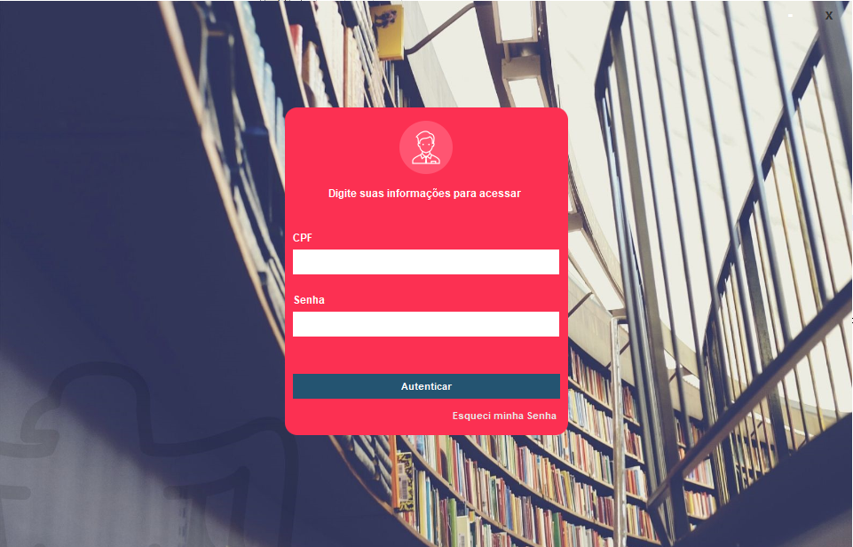
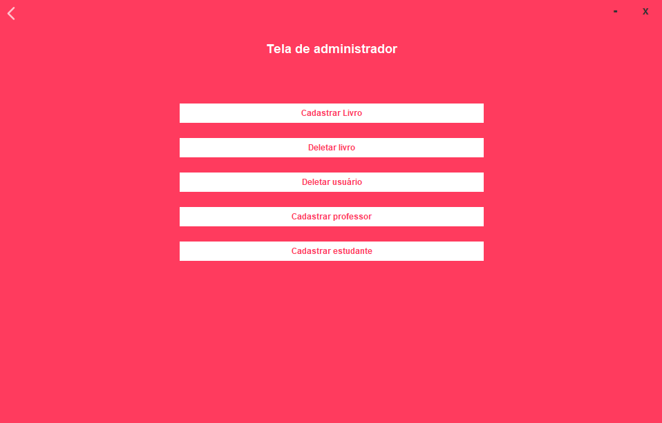
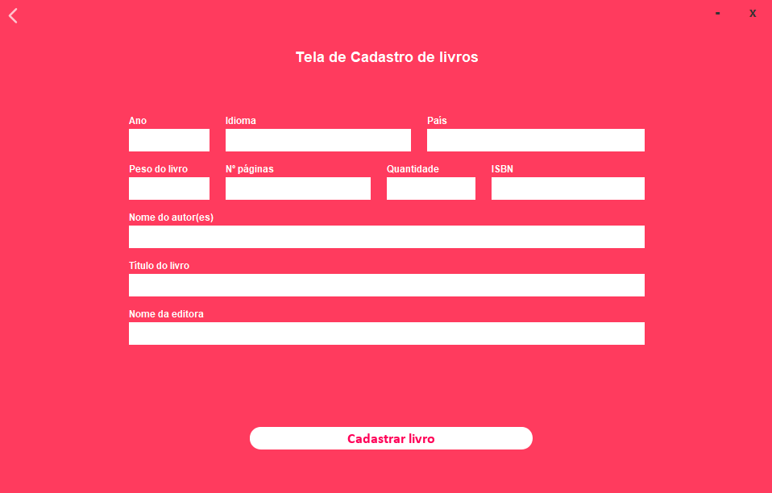
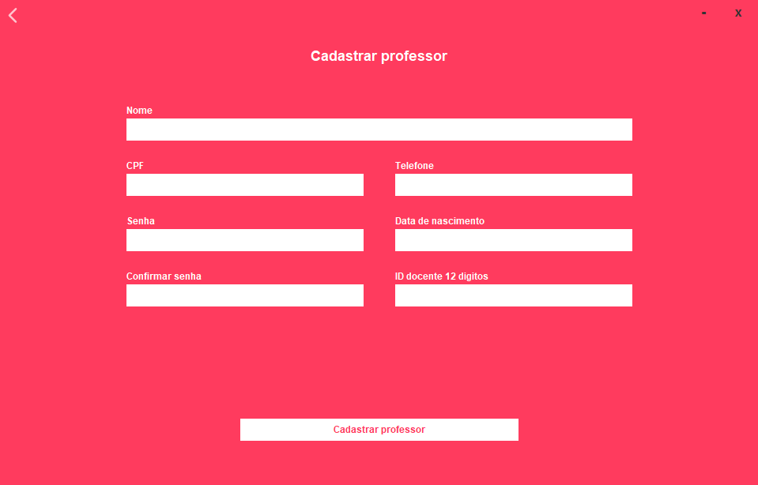
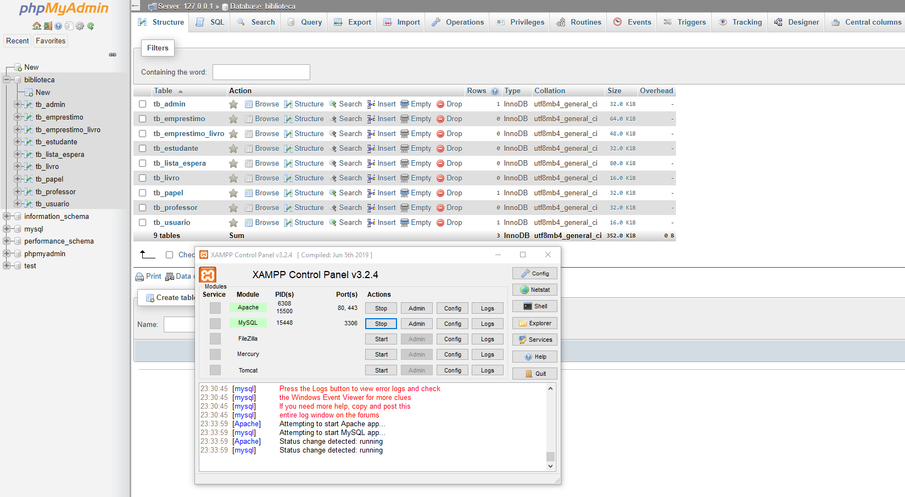

# Library

### Development of a book loan management program, of the curricular component: programming III
### Student: José Nathanael Santos Matos
### Programming language: java
Apache NetBeans IDE

	
